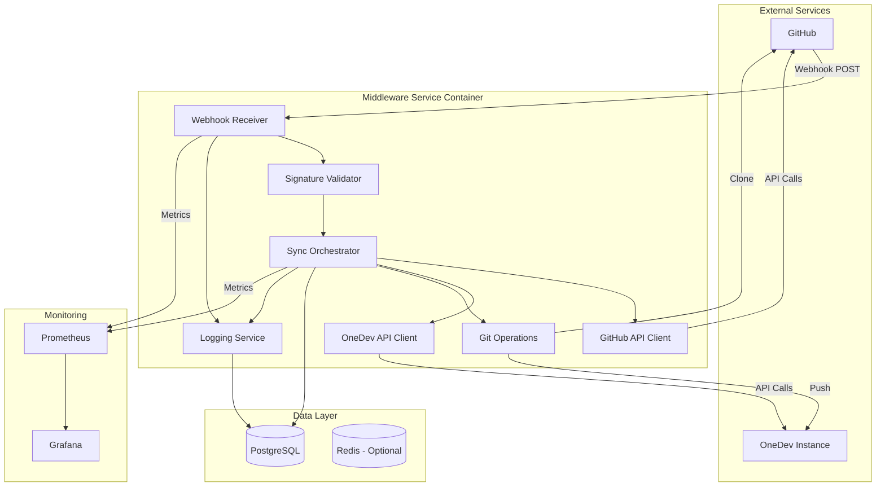
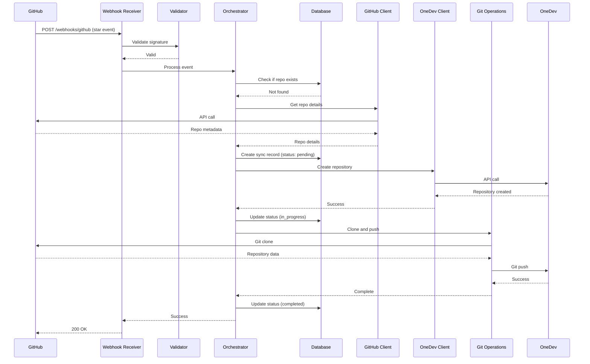
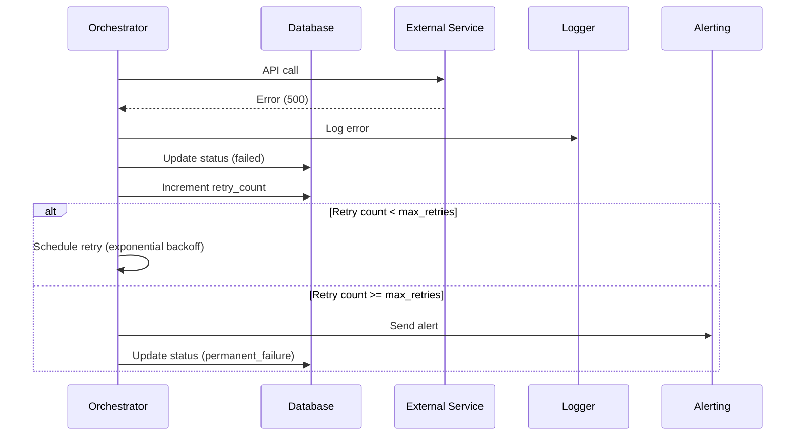
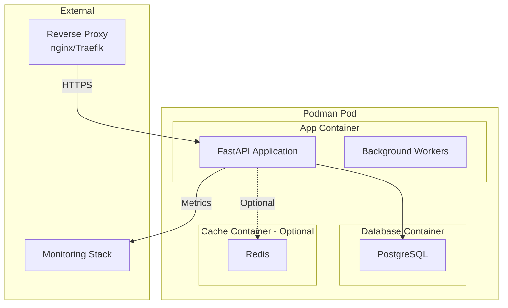
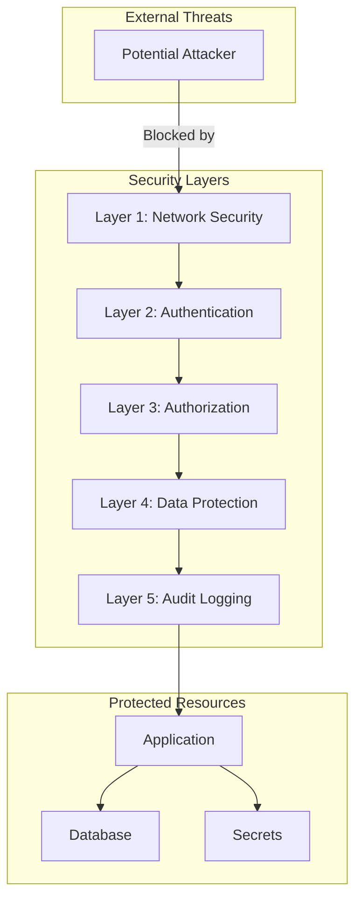

# Architecture Overview

## System Architecture

The GitHub-to-OneDev Sync Service is designed as a microservice-based architecture with clear separation of concerns and modular components.

## High-Level Architecture Diagram



## Component Responsibilities

### 1. Webhook Receiver
**Purpose**: Entry point for GitHub webhook events

**Responsibilities**:
- Accept HTTP POST requests from GitHub
- Extract webhook payload and headers
- Pass to signature validator
- Return appropriate HTTP status codes

**Technology**: FastAPI endpoint

**Key Endpoints**:
- `POST /webhooks/github` - Receive GitHub webhooks
- `GET /health` - Health check
- `GET /metrics` - Prometheus metrics

### 2. Signature Validator
**Purpose**: Ensure webhook authenticity

**Responsibilities**:
- Verify HMAC-SHA256 signature
- Validate payload structure
- Prevent replay attacks (optional: timestamp validation)
- Log validation failures

**Security**: Uses webhook secret from GitHub App configuration

### 3. GitHub API Client
**Purpose**: Interact with GitHub REST/GraphQL API

**Responsibilities**:
- Fetch repository metadata
- Handle authentication (GitHub App JWT)
- Implement rate limiting
- Cache responses (optional)
- Handle API errors gracefully

**API Endpoints Used**:
- `GET /repos/{owner}/{repo}` - Repository details
- `GET /user/starred` - List starred repositories (for batch sync)

### 4. OneDev API Client
**Purpose**: Interact with OneDev REST API

**Responsibilities**:
- Create repositories in OneDev
- Check repository existence
- Handle naming conflicts
- Manage authentication (API token)
- Handle API errors

**API Endpoints Used** (to be confirmed):
- `POST /api/projects` - Create repository
- `GET /api/projects/{name}` - Check existence
- `DELETE /api/projects/{name}` - Delete repository (for un-starring)

### 5. Sync Orchestrator
**Purpose**: Coordinate the synchronization workflow

**Responsibilities**:
- Implement business logic
- Coordinate between components
- Manage transaction boundaries
- Handle errors and retries
- Update database state
- Ensure idempotency

**Workflow**:
1. Receive validated webhook event
2. Check database for existing sync
3. Fetch repository details from GitHub
4. Create repository in OneDev
5. Trigger git clone and push
6. Update database with result
7. Log completion

### 6. Git Operations
**Purpose**: Perform git clone and push operations

**Responsibilities**:
- Clone repository from GitHub
- Configure git credentials
- Push to OneDev
- Handle large repositories
- Clean up temporary files
- Implement timeout handling

**Technology**: GitPython or subprocess

**Considerations**:
- Temporary directory management
- Memory usage for large repos
- Network bandwidth
- Authentication (SSH vs HTTPS)

### 7. Database Layer
**Purpose**: Persist synchronization state

**Responsibilities**:
- Store repository metadata
- Track sync status
- Store error messages
- Provide audit trail
- Support queries for admin API

**Schema**: See [database-schema.md](database-schema.md)

### 8. Logging Service
**Purpose**: Centralized logging and observability

**Responsibilities**:
- Structured logging (JSON format)
- Correlation ID tracking
- Log aggregation
- Error tracking
- Performance monitoring

**Log Destinations**:
- Console (stdout/stderr)
- File (rotated logs)
- Database (audit logs)
- External service (optional: Elasticsearch, Datadog)

## Data Flow

### Synchronization Flow



### Error Handling Flow



## Deployment Architecture

### Container Architecture



### Network Architecture

```
Internet
    ↓
[Firewall]
    ↓
[Reverse Proxy] (HTTPS termination)
    ↓
[Middleware Service] (Port 8000)
    ↓
[PostgreSQL] (Port 5432, internal only)
    ↓
[OneDev Instance] (Internal network or VPN)
```

## Scalability Considerations

### Horizontal Scaling

**Current Design**: Single instance (sufficient for personal use)

**Future Scaling Options**:
1. **Multiple webhook receivers**: Load balancer + multiple app instances
2. **Async task queue**: Celery/RQ for background processing
3. **Database replication**: Read replicas for queries
4. **Caching layer**: Redis for frequently accessed data

### Vertical Scaling

**Resource Requirements** (estimated):
- **CPU**: 1-2 cores (2+ for large repos)
- **Memory**: 2-4 GB (more for large repos)
- **Disk**: 20 GB + space for temporary clones
- **Network**: 100 Mbps+ (depends on repo sizes)

### Performance Optimization

1. **Async Processing**: Use async/await for I/O operations
2. **Connection Pooling**: Reuse database and HTTP connections
3. **Caching**: Cache GitHub API responses
4. **Batch Operations**: Process multiple webhooks in parallel
5. **Lazy Loading**: Only fetch data when needed

## Security Architecture

### Security Layers



### Security Controls

1. **Network Security**:
   - HTTPS only (TLS 1.2+)
   - Firewall rules
   - IP allowlisting (optional)

2. **Authentication**:
   - Webhook signature verification
   - GitHub App JWT authentication
   - OneDev API token authentication

3. **Authorization**:
   - Least privilege principle
   - Service account permissions
   - API scope restrictions

4. **Data Protection**:
   - Secrets in environment variables
   - Encrypted database connections
   - No secrets in logs

5. **Audit Logging**:
   - All webhook events logged
   - All sync operations logged
   - Failed authentication attempts logged

## Technology Stack Summary

| Layer | Technology | Version | Purpose |
|-------|-----------|---------|---------|
| **Language** | Python | 3.11+ | Application runtime |
| **Web Framework** | FastAPI | 0.104+ | HTTP server and API |
| **ASGI Server** | Uvicorn | 0.24+ | Production server |
| **Database** | PostgreSQL | 15+ | State persistence |
| **ORM** | SQLAlchemy | 2.0+ | Database abstraction |
| **Migrations** | Alembic | 1.12+ | Schema migrations |
| **HTTP Client** | httpx | 0.25+ | Async HTTP requests |
| **GitHub API** | PyGithub | 2.1+ | GitHub integration |
| **Git Operations** | GitPython | 3.1+ | Git clone/push |
| **Validation** | Pydantic | 2.4+ | Data validation |
| **Testing** | pytest | 7.4+ | Test framework |
| **Containerization** | Podman | 4.0+ | Container runtime |
| **Monitoring** | Prometheus | 2.45+ | Metrics collection |

## Design Principles

### 1. Modularity
- Each component has a single responsibility
- Components communicate through well-defined interfaces
- Easy to test in isolation

### 2. Reliability
- Comprehensive error handling
- Retry mechanisms for transient failures
- Idempotent operations
- State persistence

### 3. Observability
- Structured logging
- Metrics collection
- Health checks
- Audit trails

### 4. Security
- Defense in depth
- Least privilege
- Secure by default
- Regular security audits

### 5. Maintainability
- Clear code structure
- Comprehensive documentation
- Automated testing
- Easy deployment and updates

## Future Enhancements

### Phase 1 Enhancements
- [ ] Web UI for management
- [ ] Webhook replay capability
- [ ] Batch synchronization
- [ ] Repository update detection

### Phase 2 Enhancements
- [ ] Support for GitLab and Bitbucket
- [ ] Multi-tenant support
- [ ] Advanced filtering (by language, stars, etc.)
- [ ] Scheduled synchronization

### Phase 3 Enhancements
- [ ] Distributed architecture
- [ ] High availability setup
- [ ] Advanced analytics
- [ ] Machine learning for repo recommendations

## References

- [FastAPI Documentation](https://fastapi.tiangolo.com/)
- [GitHub Webhooks Guide](https://docs.github.com/en/developers/webhooks-and-events/webhooks)
- [OneDev Documentation](https://docs.onedev.io/)
- [Podman Documentation](https://docs.podman.io/)
- [PostgreSQL Documentation](https://www.postgresql.org/docs/)

---

**Last Updated**: 2025-10-04  
**Version**: 1.0

